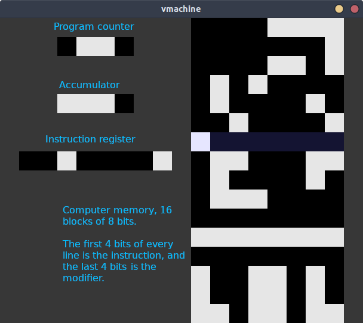

# VMachine

A virtual machine designed to learn about cpu architecture.



## Why ?

I made this virtual machine to confirm that I understood how computer and cpu worked.
As a side effect, I guess it can also be used to learn about cpu architectures, machine code, assembly and compilers !

This is the very first version, a proof of concept. I plan to make more version to iterate over the concept and make it actually useful, 16 bytes is currently pretty useless :)

## Architecture

- 16 bytes memory
- "8 bits" architecture : 8 bits instruction register, but in reality 4 bits instruction and 4 bit modifier.
- 4 bits accumulator (ACC)
- 4 bits program counter (PC)

## Instruction set

- NOP : ```0000 ----``` no op, used to store value in the lower 4 bits
- LDA : ```0001 ADRS``` load value at memory adress ADDR into accumulator
- ADD : ```0010 ADRS``` add value at memory adress ADDR to value in accumulator and store the result in accumulator
- SUB : ```0011 ADRS``` subst value at memory adress ADDR to value in accumulator and store the result in accumulator
- STO : ```0100 ADRS``` store accumulator value into memory adress ADDR
- OUT : ```0101 ----``` output value in accumulator to the host's terminal
- JMP : ```0110 ADRS``` change the program counter to the value stored in memory adress ADDR
- HLT : ```0111 ----``` halt the computer
- CMP : ```1000 ADRS``` compare value in memory adress ADRS and value stored in accumulator, program counter is incremented by 1 if they are the same bit for bit (the next instruction is then skip entirely, since the program counter is incremented after the execution of every instruction)

## How to

- Pass a path to a file containing a "vbinary" as the first argument of the program. It must contain at most 128 '0' and '1' **characters** that will be loaded into the virtual computer's memory. As example vbin file is provided il this repo. If no file is provided, the machine will load the default test program.
- ```ESCAPE``` at any time during the execution will stop the virtual machine at the current step.
- When stopped, any key will quit the program.

## Requirements

- SDL2
- (optional) make

## TODO and Ideas

- [x] add comparator instruction
- [x] visual representation with SDL
- [x] load "binary" from file to program memory
- [ ] better delay management: delay all the time and full-speed when key pressed ? Different speed settings ? Programmable frequency ?
- [ ] extend to 16 bits instructions : 4 bits op code, 12 bits modifier (4096 bytes of addressable memory) ?
- [ ] python assembler to translate assembly to "machine code" that can be read by the virtual machine.
- [ ] multiple memory banks ?
- [ ] framebuffer and display ?
- [ ] IOs ? At least keyboard ?
- [ ] Stack architecture ?

